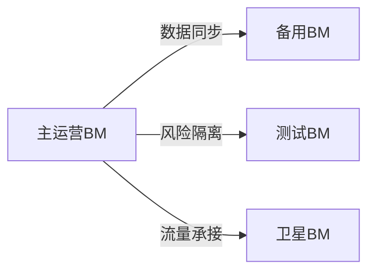

# Meta广告运营效率提升体系

---

## 多维账户矩阵配置
### 平台级部署方案

| 账户类型   | 功能定位            | 消耗阈值       |
|------------|-------------------|----------------|
| 核心BM     | 主力转化承接       | $50000+/月     |
| 卫星BM     | 地域化内容运营     | $15000-30000   |
| 测试BM     | 新素材版本验证     | ≤$10000        |

---

## 视觉素材质量控制系统
### 素材工程标准
| 元素类型   | 制作规范                      | 检测工具          |
|------------|------------------------------|-------------------|
| 主视觉     | 3秒内信息呈现                 | Adobe Analytics   |
| 动态元素   | 时长8-15秒/切换频率≤2秒       | Premiere Pro      |
| 文案植入   | 核心卖点≤7字/辅助信息≤20字    | Grammarly         |
| 转化组件   | CTA按钮停留≥1.5秒             | Hotjar热力图      |

### 工具选型建议
- **图片制作**: Canva专业版(电商模板库)
- **视频剪辑**: InVideo AI(批量生成)
- **动态设计**: Animoto(可视化编辑器)

---

## 智能受众分层模型
### 动态管理方案
```process
初始分层 → 行为标记 → 策略匹配 → 效果追踪
   ↓            ↓            ↓           ↓
核心受众     兴趣扩展     相似用户     定向排除
```

### 再营销执行框架
| 受众状态         | 触发条件            | 投放策略                 |
|------------------|---------------------|--------------------------|
| 页面浏览         | 访问≥3次未转化      | 动态商品广告             |
| 加购未购         | 放弃支付≤24小时     | 限时折扣专享             |
| 复购窗口期       | 上次购买≥30天       | 会员特权提醒             |
| 深度互动用户     | 视频观看≥75%        | 精准内容推荐             |

---

## 动态预算调控模型
### 机器学习方案
```math
实时系数 = \frac{(点击价值 × 0.6) + (时段权重 × 0.4)}{竞争指数} \times 素材衰减因子
```

### 应急处理机制
| 异常类型     | 判定标准          | 应急预案                     |
|-------------|------------------|-----------------------------|
| CPM异常     | 涨幅≥35%持续4小时 | 暂停投放 → 换组重启          |
| CTR衰减     | 下降≥25%持续12小时| 素材AB测试 → 兴趣词优化      |
| 转化断层    | 空窗≥8小时       | 启动备用落地页 → 定向放宽    |

---

## 全域风险控制体系
### 安全防护等级
```risk-structure
基础防护层:
  - 设备指纹识别
  - IP信誉评估

智能分析层:
  - 用户行为建模
  - 异常模式检测

人工决策层:
  - 三级复核制度
  - 应急专家小组
```

### 数据管理规范
| 数据类型      | 存储周期 | 清洗规则        | 使用限制       |
|---------------|---------|-----------------|----------------|
| 用户行为数据  | 180天   | 去标识化处理     | 仅限内部使用   |
| 财务记录      | 永久    | 双重加密         | 审计专用       |
| 素材版本      | 90天    | 自动去重         | 策略优化参考   |

---

> **执行建议**: 建议每周一进行全域健康诊断，每季度更新风控规则库。测试期间保持3组平行实验组运行，关键策略变更需进行48小时观察期。启用自动化规则管理系统，异常波动阈值建议设置在15%-25%区间。
[教学视频](https://youtube.com/shorts/A_qiK9jr6Eo?feature=share)
